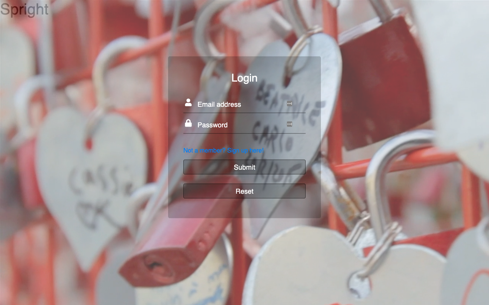

# SPRight

## Description
SPRight is a unique web application that revolutionizes the concept of online dating. Unlike traditional platforms that rely on photos and personal information, SPRight focuses on connecting users through their voices. By emphasizing the power of voice communication, SPRight creates a more authentic and meaningful connection between users.

Through the platform, users can listen to voice recordings of other users and express their interest by liking each other. When there is a mutual match, a chatroom is automatically created, allowing users to engage in real-time conversations and get to know each other better. This initial emphasis on voice interaction promotes genuine connections based on personality and chemistry.

Once connected, users have the option to share personal information and photos to further deepen their connection. Additionally, SPRight introduces a unique rating system that allows users to provide feedback and rate each other, fostering a positive and respectful community.

SPRight breaks the mold of traditional dating platforms by prioritizing the power of voice and genuine connections. It offers a refreshing and exciting approach to online dating, where users can truly get to know each other before revealing personal information.

## Features
1. Voice-based dating platform: SPRight emphasizes connecting users through their voices rather than relying solely on photos and personal information.

2. Mutual matching: Users can express their interest in each other by mutually liking each other's voice recordings.

3. Instant chatroom: When a mutual match occurs, a chatroom is automatically created for users to engage in real-time conversations.

4. Personal information and photo sharing: Once connected, users have the option to share personal information and photos to deepen their connection.

5. Rating system: SPRight introduces a unique rating system where users can provide feedback and rate each other, promoting a positive and respectful community.

## Screenshots

*Utilized Passport.js to handle the authentication process with a username and password. Password is hashed before stored into DB*

*List of users will be shown based on your preferences*

*A real-time chatroom is created once matched*

*A notification will be popped up once matched*

*User can rate to their matched users*

## Architecture

*The frontend static files and backend server is deployed to EC2.*

## Technologies Used
SPRight incorporates a range of technologies, frameworks, and tools to deliver its robust functionality and optimal performance. The key technologies that played a significant role in the project include:

Frontend:
- HTML
- CSS
- Vanilla JavaScript

Backend:
- NodeJS (with Typescript)
- Express.js
- Knex.js
- Socket.io

Database:
- PostgreSQL

Infrastructure:
- AWS (Amazon Web Services)
- EC2 (Elastic Compute Cloud)
- Route53
- Nginx

## Challenges and Solutions
1. **Challenge** Implementing a real-time chatroom feature that allows users to engage in real-time conversations.

   **Solution:** To implement the chatroom feature, we utilized Socket.io, a JavaScript library that enables real-time, bidirectional, and event-based communication between the browser and the server. Socket.io allowed us to create a chatroom that supports real-time communication between users. Additionally, we used Socket.io's rooms feature to create a unique chatroom for each pair of users. This allowed us to create a chatroom that is specific to each pair of users, where they can engage in real-time conversations.

2. **Challenge** Designing the database schema from scratch to support the application's functionality.

   **Solution:** We used diagrams.net to design the database schema. We started by identifying the key entities in the application, which included users, voice recordings, and chatrooms. We then identified the relationships between the entities, which included one-to-one, one-to-many, and many-to-many relationships. Once we identified the entities and their relationships, we created the database schema using diagrams.net. This allowed us to visualize the database schema and ensure that it supports the application's functionality.

3. **Challenge** Setting up the CI/CD pipeline to automate the deployment process.

   **Solution:** We used GitLab CI/CD to set up the CI/CD pipeline. We started by creating a workflow that runs the tests and linter on every push to the production branch. We then created a workflow that automatically deploys the application to the AWS EC2 instance when a new release is created. This allowed us to automate the deployment process and ensure that the application is always up-to-date.

## Future Enhancements

### 1. Features Enhancement
- Add a matching algorithm that matches users based on their voice recordings
- Add a voice recording feature that allows users to record their voice directly on the platform
- Report feature that allows users to report inappropriate behavior

### 1. Performance Optimization
- Create indexes for the database tables to improve the performance of the database queries
- Implement caching to reduce the number of database queries
- Seperate the frontend, backend and database servers to improve the performance of the application
- Use a single page application framework (e.g. React) to improve the performance of the application

### 2. Reliability
- Use load balancers to distribute the traffic across multiple servers
- Use a database replication strategy to ensure that the database is always available
- Use multiple availability zones to ensure that the application is always available

### 3. Cost Optimization
- Use reserved instances to reduce the cost of the EC2 instances
- Use S3 to store the voice recordings and photos to reduce the cost of the EC2 instances

